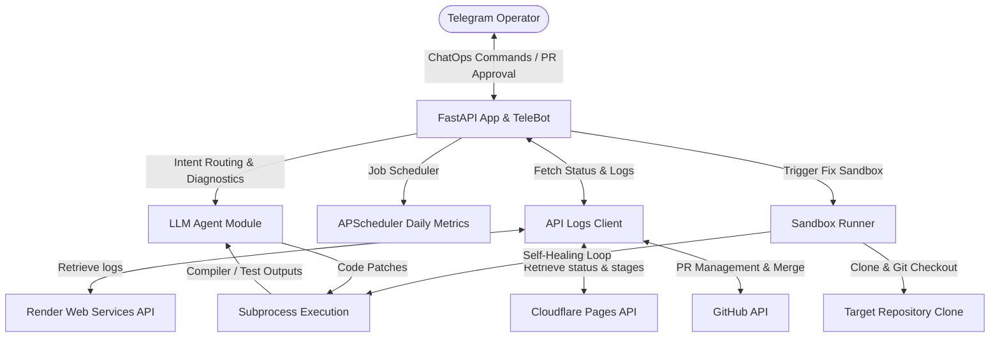

# Autoopsy 🤖
### *Autonomous Stack-Agnostic Site Reliability Engineering (SRE) DevSecOps Agent*

**Autoopsy** (Autonomous + Ops + Autopsy) is a state-of-the-art, closed-loop DevSecOps SRE agent. It bridges the gap between infrastructure monitoring and automated code remediation. By listening to live production alerts, analyzing raw container logs, running an isolated code-repair sandbox, and requesting human-in-the-loop validation via Telegram ChatOps, Autoopsy automates the entire lifecycle of incident response and self-healing systems.

This project is a showcase of advanced agentic AI architectures, LLM orchestration, automated software repair, and real-time infrastructure engineering.

---

## 🛠️ Closed-Loop Architecture & Lifecycle

Autoopsy operates as a continuous closed-loop SRE assistant:



### 1. Detection & Monitoring
Autoopsy hooks into live production services on **Render** (backend) and **Cloudflare Pages** (frontend). It fetches raw server logs and build pipeline histories via authenticated API clients.

### 2. Intelligent Log Diagnostics
When an anomaly occurs (or upon requesting `/debug`), the LLM Diagnostic Engine analyzes the system status. It performs a log "autopsy" to pinpoint the exact failure—classifying it as a backend bug, database timeout, frontend configuration issue, or memory leak.

### 3. Isolated Sandbox Healing
If code repair is triggered (`/fix`), Autoopsy:
*   Clones the targeted repository inside an isolated workspace.
*   Parses the project's local `.agent-ops.yml` configuration.
*   Spawns a self-correcting editing loop (powered by **Aider** or a **native LLM Coder**).
*   Applies code modifications, compiles the app, and executes the test suite. If tests fail, it feeds the compiler errors back to the model, iterating up to 3 times until the build compiles and passes successfully.

### 4. GitOps Pull Request Workflow
Once the local sandbox compiles and tests pass, Autoopsy pushes the code to a new git branch on GitHub and creates a Pull Request automatically.

### 5. ChatOps Human-in-the-Loop Approval
Instead of deploying code autonomously without oversight, Autoopsy sends a detailed diagnostic summary and PR review card directly to the Telegram operator with interactive actions:
*   `[Approve & Merge]`: Merges the PR on GitHub, deletes the remote branch, and triggers the production build.
*   `[Reject & Close]`: Closes the PR without merging and cleans up remote branches.

---

## 🌟 Key Features

*   **Self-Correcting Coder Engine**: Leverages isolated subprocess runners to test modifications and read compiler errors in real time, preventing broken code from ever reaching staging or production.
*   **Multi-Provider LLM Integration**: Fully compatible with the Google GenAI SDK (Gemini) and OpenAI API standard (supporting DeepSeek, Llama 3.1 on DeepInfra/Fireworks).
*   **Dual Telegram Hook Modes**: Support for long-polling (simplifying local development without ngrok tunnels) and webhooks (optimized for production server deployment).
*   **Secure Access Controls**: Whitelisting wrapper blocks unauthorized Telegram users from invoking SRE diagnostics or modifying repositories.
*   **APScheduler Daily Performance Cards**: Pushes a daily performance summary at a configured time, parsing logs to compute real-time HTTP success/error ratios (2xx, 3xx, 4xx, 5xx) and system statuses.

---

## 📲 SRE ChatOps Command Menu

Autoopsy automatically registers its native command autocomplete menu with Telegram on startup:

*   🔌 `/status` - Check Render backend & Cloudflare frontend status at a glance, with real-time domain reachability and SRE quick-action buttons.
*   🔍 `/debug` - Fetch raw backend container logs and run an LLM incident diagnostics autopsy.
*   🛠️ `/fix [component]` - Spin up an isolated sandbox, run build/tests, apply fixes automatically, and open a Pull Request.
*   📋 `/logs [limit]` - Fetch and display recent raw backend container logs (default: 25 lines).
*   ⚡ `/frontend` - Fetch and display frontend build stages and default/custom domain reachability.
*   🧹 `/clear` - Reset conversational chat context history to prevent memory pollution.
*   ❓ `/help` - Show the SRE bot command guide and configuration details.

---

## 📂 Project Structure

```text
├── app/
│   ├── __init__.py
│   ├── agent.py         # LLM agent configurations, prompt templates, and self-correcting coder loop
│   ├── bot.py           # Telegram command routing, ChatOps inline buttons, and scheduled report formats
│   ├── config.py        # Environment validation, .env configurations, and Chat ID cache
│   ├── logs_client.py   # API clients for Render, Cloudflare Pages, and GitHub
│   ├── main.py          # FastAPI application entrypoint, Webhook routes, and Lifespan managers
│   └── runner.py        # Sandbox workspace managers, subprocess command executors, and Aider engine wrappers
├── .agent-ops.yml       # Configuration schema example for targeted repositories
├── requirements.txt     # Python application dependencies
└── README.md            # You are here
```

---

## ⚡ Quick Start

### 1. Installation
Clone the repository and set up your virtual environment:
```bash
git clone https://github.com/wesley-ka/Autoopsy.git
cd Autoopsy
python3 -m venv venv
source venv/bin/activate
pip install -r requirements.txt
```

### 2. Configure Environment (`.env`)
On the first execution, a template `.env` file will be generated in your project root. Populate it with your API tokens:
```bash
# 1. Telegram
TELEGRAM_BOT_TOKEN=your_telegram_bot_token
ALLOWED_TELEGRAM_USER_IDS=12345678,98765432

# 2. GitHub
GITHUB_PAT=your_github_personal_access_token

# 3. Targets
RENDER_API_KEY=your_render_api_key
TARGET_RENDER_SERVICE_ID=your_render_service_id
CLOUDFLARE_API_TOKEN=your_cloudflare_api_token
CLOUDFLARE_ACCOUNT_ID=your_cloudflare_account_id
CLOUDFLARE_PROJECT_NAME=your_cloudflare_pages_project

# 4. LLM Configuration
LLM_PROVIDER=openai  # "openai" or "gemini"
LLM_API_KEY=your_llm_api_key
LLM_BASE_URL=https://api.deepinfra.com/v1
LLM_MODEL_DIAGNOSTIC=deepseek-ai/DeepSeek-V4-Flash
LLM_MODEL_CODER=deepseek-ai/DeepSeek-V4-Pro

# 5. Service & Monitoring Configurations
PORT=8000
HOST=0.0.0.0
DAILY_REPORT_TIME=09:00
# Optional: Comma-separated list of custom domains to monitor reachability for
CUSTOM_DOMAINS=example.com,www.example.com
# Set to true to enable simulation fallback in offline/test environments
ENABLE_MOCK_FALLBACK=false
```

### 3. Run the Application
Start the service from the root workspace directory:
```bash
python -m app.main
```
*Note: To run in local development polling mode, leave `WEBHOOK_URL` empty in your `.env`.*

---

## 🔌 Target Project Integration (`.agent-ops.yml`)

For Autoopsy to autonomously fix a repository, the target codebase must include a `.agent-ops.yml` file in its root. This defines how to build, test, and pinpoint core architectural files:

```yaml
# .agent-ops.yml
build_command: "npm install && npm run build"
test_command: "npm run test"

# Crucial files loaded immediately into the LLM Coder's context
core_files:
  - "src/app.js"
  - "src/routes/auth.js"
  - "src/config/database.js"
```
